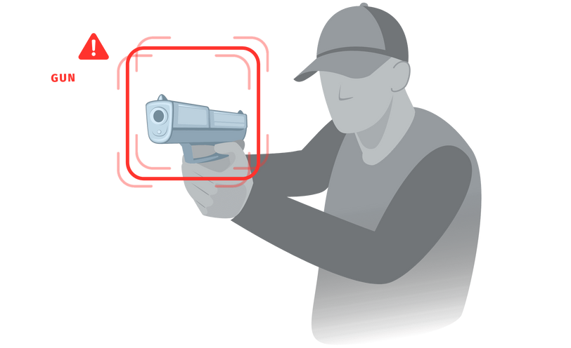

# UTN-IAA-WEAPON-DETECTION

> Trabajo practico de deteccion de armas para la asignatura Inteligencia Artificial Avanzada



## REQUERIMIENTOS

* **Python 3.8+**

## INSTALACION

* Pararse en la ruta raiz del proyecto python instalado y ejecutar:
```
sudo apt-get install libcudart10.1
pip install -r requirements.txt
```
